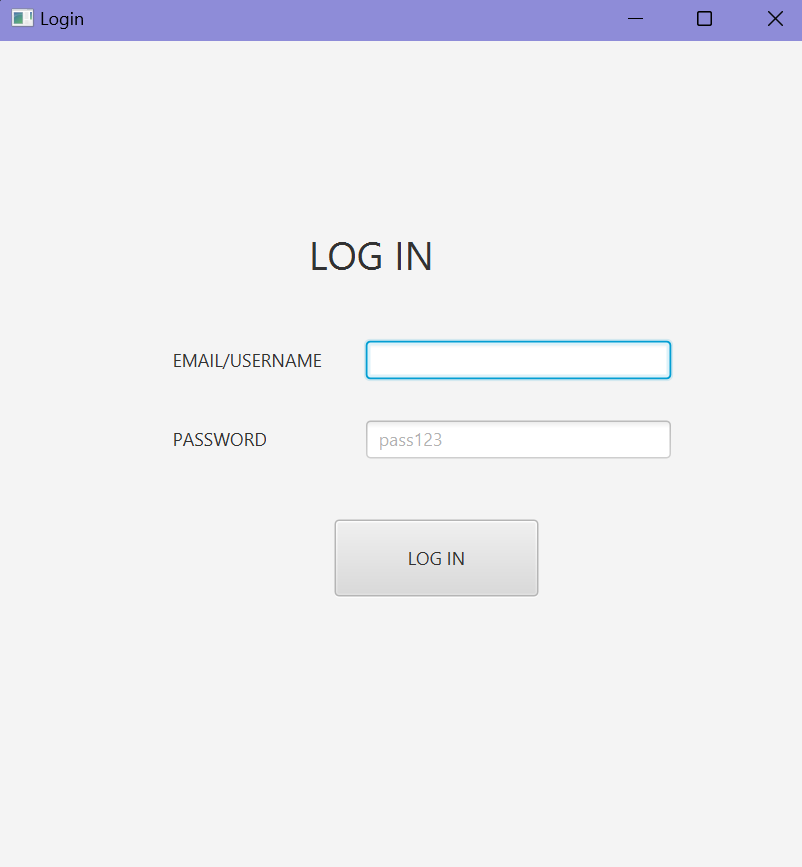
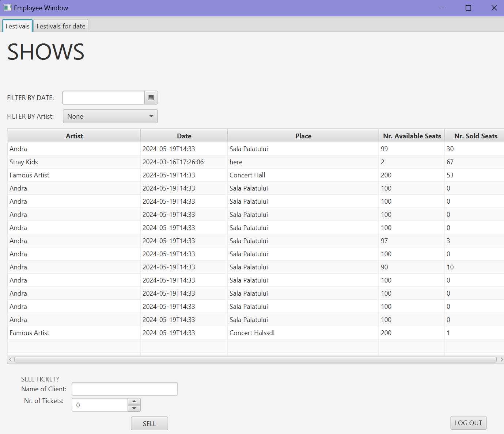
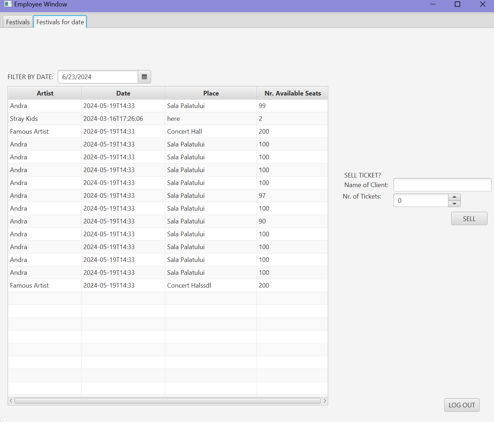
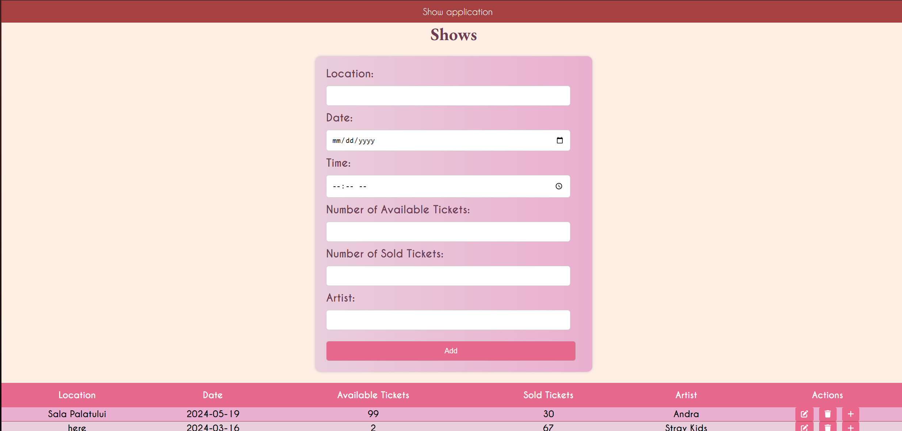
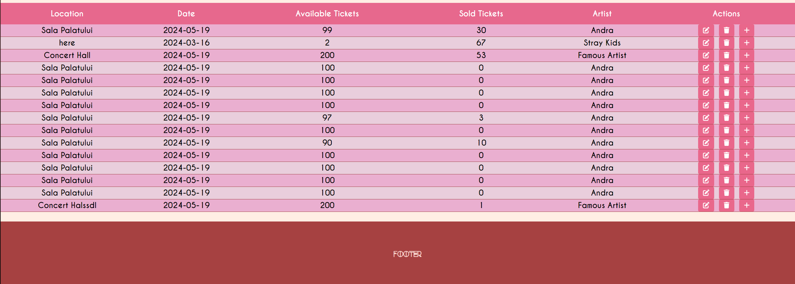
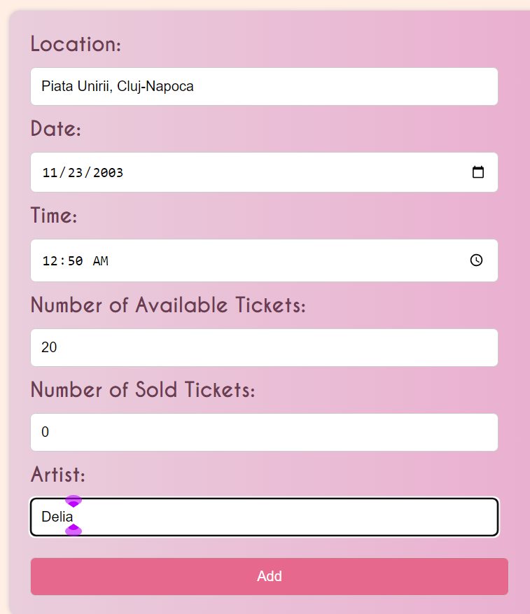
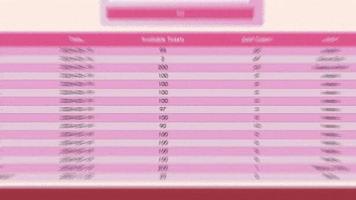

# Multi-Language Client-Server Application

## Introduction
Project made during the "Systems for Design and Implementation" course.
I had to create a simple Festival Ticket sale Application both in Java and C#.
As a final assignment , I had to implement Rest in Java and create a WEB Interface for which I have chosen to use the REACT framework.

## About Project
In both C# and Java , the application can be run with a server-client application through Object protocol in C#, and 
Json Protocol in Java.
Also the projects can be used as server and client, server being the C# implementation and client the Java implementation through ProtoBuff Communication!
## Technologies Used
- **Java/JavaFX**: For the java interface.
- **C# with Windows Forms**: For the C# interface.
- **protobuff**: For client-server communication.
- **Protocol Buffers**: For data serialization.
- **Hibernate**: For ORM in Java.

## Features
- **Interactive GUIs** in JavaFX , Windows Forms, React.
- **protobuf communication** allows seamless interaction between Java and C# applications.
- **Hibernate integration** on the Java side for handling database operations.

## Future Enhancements
- Improve error handling and add more robust connection management.
- Extend the database functionality with more complex entity relationships.

## Java FX Interface & C# Interface
- both interfaces are really alike
- Because of that I will just show the JavaFX interface:

- After logging in successfuly the Main window is composed of two tabs:
    - The main window containing :
        
    - If the user clicks on a date to filter the other tab opens (that is what was asked for in the assignment):
    
In both tabs a show can be selected and you can add the name of the client and number of tickets they want to buy.

## React Interface
- For the web interface I had to do CRUD on one of the entities. I chose of course Shows.
- I have implemented Rest in Java and then made the front-end with React.
### Adding shows:
To add you need to make sure nothing is selected.
If something is selected it means you want to update something as shown in the small GIF I have provided.

### Seeing Shows:

Here the person who has access to the site can add tickets sold by clicking the '+' button.
If you want to delete a show just a click the 'trash button' to delete.
If the person wants to update you can click the edit button and the information will be added in the form .

A small presentation of it:
